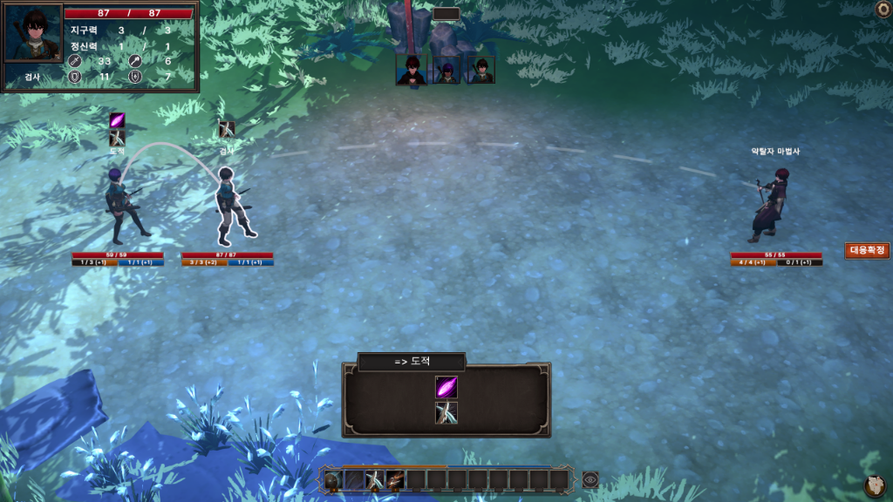
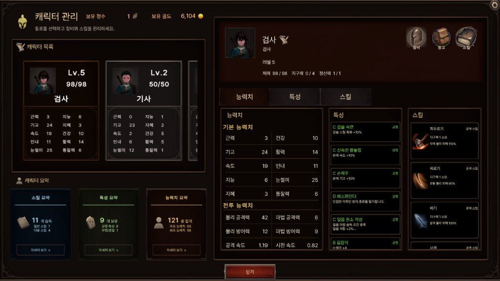
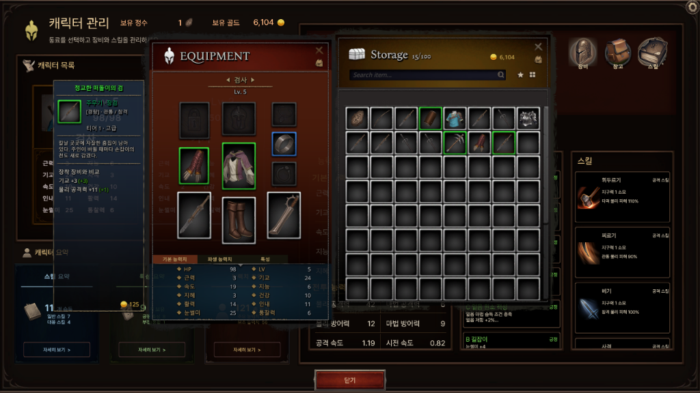
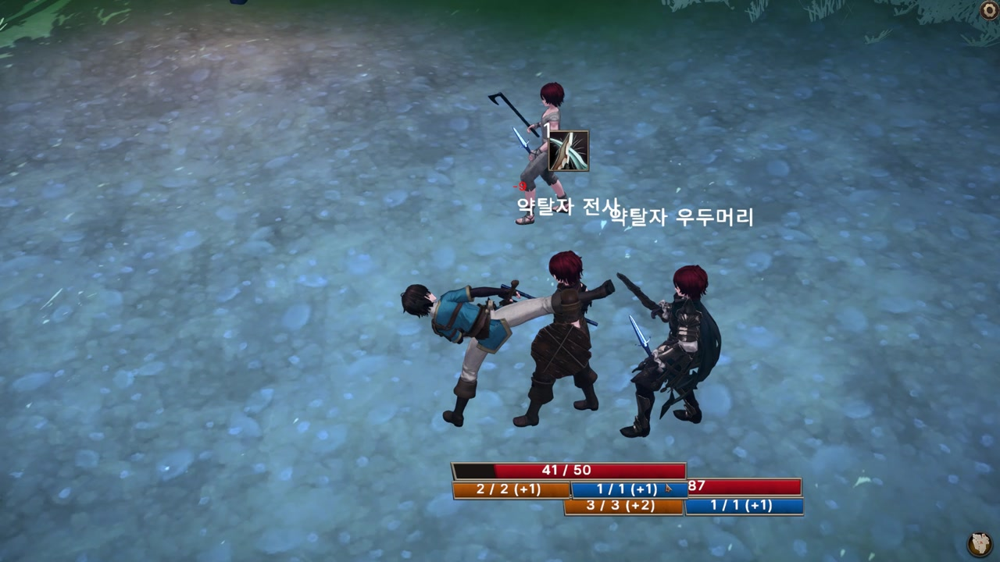
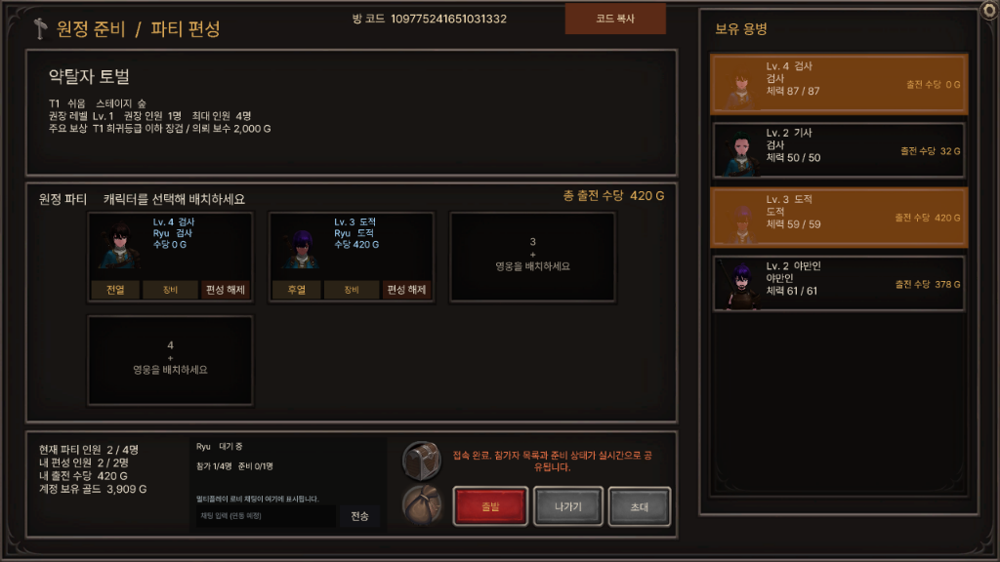
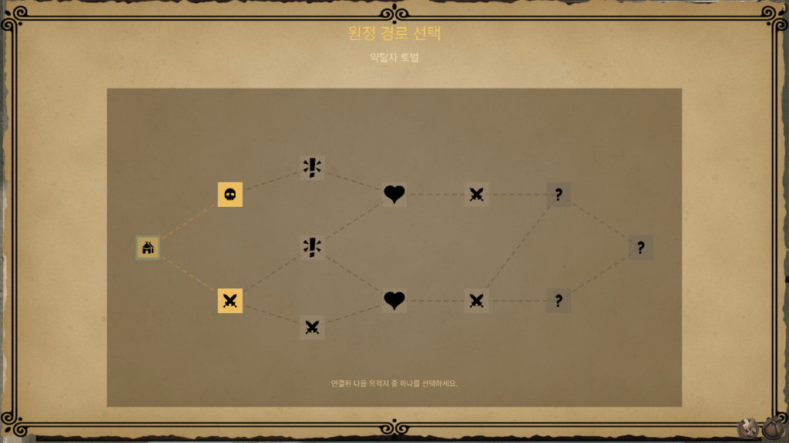

<div align="center">

# PROJECT L


**용병의 특성 · 장비 · 스킬을 조합하는 PC 턴제 로그라이크 RPG**


게임플레이 프로그래밍 포트폴리오 · 개발자 **류진영**



[프로젝트 소개](#프로젝트-소개) · [핵심 플레이](#핵심-플레이) · [구현 포인트](#구현-포인트) · [코드 탐색](#코드-탐색) · [개발 현황](#개발-현황)

</div>

---

## 프로젝트 소개

Project L은 용병단 운영, 턴제 전투, 반복 원정을 연결한 게임입니다. 서로 다른 특성과 장비 조건을 가진 용병을 구성하고, 원정에서 마주하는 상황에 맞춰 행동 순서와 대응을 선택합니다.

**전투에 들어가기 전의 구성과 전투 중의 판단이 함께 결과를 만드는 경험**을 목표로 개발하고 있습니다. 혼자 진행하는 원정과 각자 육성한 용병을 함께 편성하는 협동 플레이를 지원하는 방향으로 제작 중입니다.

| 항목 | 내용 |
| :--- | :--- |
| 장르 | 턴제 로그라이크 RPG |
| 플랫폼 | PC / Steam 출시 목표 |
| 개발 환경 | Unity 6000.3.21f1 · C# · Universal Render Pipeline |
| 현재 단계 | 핵심 플레이를 체험할 수 있는 개발 데모 |
| 담당 작업 | 게임 규칙 설계, 게임플레이 기능 구현, UI 연동, 저장 데이터 처리, 멀티플레이 구현 및 테스트·개선 |

> **저장소 범위** — 이 저장소는 Unity 프로젝트의 `Assets/Scripts`에 해당하는 코드 중심 포트폴리오입니다. 씬·프리팹·리소스·프로젝트 설정을 포함한 전체 실행 프로젝트가 아니므로, 저장소 복제만으로 데모를 실행할 수는 없습니다. 아래 화면은 개발 중인 전체 프로젝트에서 촬영했습니다.

## 핵심 플레이

```text
용병 구성 · 장비 준비
        ↓
원정 파티 편성 → 경로 선택 → 전투 / 사건
                                ↓
                       전리품 획득 · 성장
                                ↓
                       다음 원정을 위한 재구성
```

### 01. 용병의 개성을 전술로 연결

용병의 능력치뿐 아니라 특성, 장비 사용 조건, 보유 스킬을 고려해 역할을 구성합니다. 개별 캐릭터의 성장과 파티 전체의 조합을 함께 고민하도록 설계했습니다.

| 캐릭터와 특성 | 장비 비교와 구성 |
| :---: | :---: |
|  |  |

### 02. 행동 순서와 방어 대응이 있는 턴제 전투

사용할 스킬과 대상을 선택하고 행동 순서를 구성합니다. 상태이상과 후속 스킬의 연계, 자원 배분, 상대 공격에 대한 대응이 전투 결과에 영향을 줍니다.

적도 동료를 대신 보호합니다. 공격 대상으로 지정한 적에게 다른 적이 개입할 수 있어, 누구를 어떤 순서로 공격할지 판단해야 합니다.



*개발 데모의 실제 장면 — 공격 대상 앞으로 다른 적이 나서서 공격을 대신 막습니다.*

### 03. 경로 선택과 원정 이후의 성장

분기된 경로에서 다음 목적지를 선택하고 전투와 사건을 진행합니다. 전리품과 성장 결과는 이후 용병단 구성으로 이어집니다.

| 원정 파티 편성 | 원정 경로 선택 |
| :---: | :---: |
|  |  |

## 구현 포인트

### 전투 행동과 대응 큐

`CombatHandler`에서 공격 스킬과 대응 스킬을 큐로 관리합니다. 대상 선택과 스킬 실행, 보호 개입을 처리하며, 판정된 대상과 보호 성공 여부 등의 결과를 후속 처리에 전달합니다.

- **살펴볼 부분:** 행동 예약, 대응 처리, 보호에 따른 실제 공격 대상 결정
- **관련 코드:** [CombatHandler.cs](https://github.com/RyuJinYeong/Portfolio_Project/blob/main/Character/CharacterManager/Handler/CombatHandler.cs) · [TurnManager.cs](https://github.com/RyuJinYeong/Portfolio_Project/blob/main/UIManager/TurnManager.cs)

### 전투 연출 구성

전투 연출을 위한 `BattlePresentationDirector`와 캐릭터의 `BattlePresentationHandler`를 두고 카메라, 캐릭터 동작 및 스킬 연출을 구성합니다. 공격과 보호 대응을 화면에서 읽을 수 있도록 표현을 개선하고 있습니다.

- **살펴볼 부분:** 전투 진행과 연출의 연결, 카메라 제어, 캐릭터 단위 표현
- **관련 코드:** [BattlePresentationDirector.cs](https://github.com/RyuJinYeong/Portfolio_Project/blob/main/GameManager/BattlePresentationDirector.cs) · [BattlePresentationHandler.cs](https://github.com/RyuJinYeong/Portfolio_Project/blob/main/Character/CharacterManager/Handler/BattlePresentationHandler.cs)

### 데이터 정의와 저장 데이터 변환

스킬과 특성의 정의를 ScriptableObject로 관리하고, 플레이어·캐릭터·원정 상태를 저장용 DTO로 변환합니다. 콘텐츠 정의와 진행 상태를 구분해 관리하며, 추가 콘텐츠를 기존 시스템에 연결할 수 있도록 개발하고 있습니다.

- **살펴볼 부분:** 콘텐츠 정의, 런타임 상태, 저장·복원을 위한 데이터 변환
- **관련 코드:** [ScriptableObject 정의](https://github.com/RyuJinYeong/Portfolio_Project/tree/main/ScriptableObject/Script) · [SaveDTO.cs](https://github.com/RyuJinYeong/Portfolio_Project/blob/main/Player/SaveDTO.cs) · [SaveMapper.cs](https://github.com/RyuJinYeong/Portfolio_Project/blob/main/Player/SaveMapper.cs)

### 협동 플레이 동기화 — 개발 데모

현재 개발 환경에서는 FishNet과 Steamworks.NET을 사용해 파티 편성과 공동 원정을 구현하고 있습니다. 전투 상태와 행동 요청을 전달하고, 참가자 화면에 편성·전투 진행이 반영되도록 처리합니다. 테스트에서 발견한 편성 동기화와 화면 표시 문제를 점검하고 개선해 왔습니다.

> 멀티플레이 관련 설명은 현재 개발 데모 기준입니다. 공개 코드에 포함된 범위와 최신 데모의 구현 범위는 다를 수 있습니다.

## 코드 탐색

처음 살펴볼 때는 **전투 → 콘텐츠 정의 → 저장 → 원정과 UI** 순서를 권장합니다.

| 경로 | 주요 내용 |
| :--- | :--- |
| [Character/](https://github.com/RyuJinYeong/Portfolio_Project/tree/main/Character) | 캐릭터, 전투 처리, 장비, 스킬, 특성 |
| [ScriptableObject/Script/](https://github.com/RyuJinYeong/Portfolio_Project/tree/main/ScriptableObject/Script) | 콘텐츠 정의 및 관련 데이터 타입 |
| [Player/](https://github.com/RyuJinYeong/Portfolio_Project/tree/main/Player) | 플레이어 데이터와 저장용 DTO·매핑 |
| [Quest/](https://github.com/RyuJinYeong/Portfolio_Project/tree/main/Quest) | 의뢰와 원정 진행 |
| [GameManager/](https://github.com/RyuJinYeong/Portfolio_Project/tree/main/GameManager) | 게임·스테이지 관리 및 전투 연출 |
| [UIManager/](https://github.com/RyuJinYeong/Portfolio_Project/tree/main/UIManager) | 전투·편성·원정 UI와 게임 상태 연결 |

*코드 탐색 링크는 `main` 브랜치를 기준으로 작성했습니다. 최신 개발 데모와 공개 코드의 구현 범위는 다를 수 있습니다.*

## 개발 현황

**데모에서 구현한 핵심 흐름**

- 용병 관리, 특성·스킬 확인 및 장비 구성
- 전열·후열을 고려한 원정 파티 편성
- 원정 경로와 사건 선택
- 공격 순서, 상태이상 연계 및 방어 대응이 있는 턴제 전투
- 전리품 획득과 캐릭터 성장
- 멀티플레이를 통한 공동 원정

**다음 개발 목표**

- 추가 지역·적·장비·스킬·사건 콘텐츠 확장
- 외부 플레이 테스트를 통한 규칙 이해도와 난이도 검증
- UI, 초반 안내, 전투 모션과 연출 개선
- 협동 플레이의 다양한 상황에 대한 안정성 점검
- 공개 체험판과 Steam 출시 준비

---

<div align="center">

**류진영 · Game Client / Gameplay Programmer**  
[GitHub](https://github.com/RyuJinYeong)

*개발 중인 프로젝트로, 화면과 세부 기능은 변경될 수 있습니다.*

</div>
